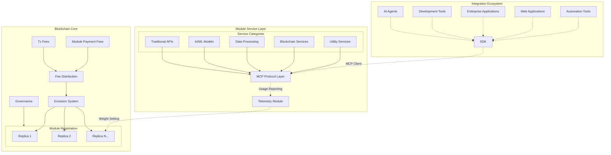

#### Blockchain Core
Provides economic incentives, service registration, and transparent fee distribution through a custom pallet that handles module registration, module replica registration, and the distribution of emission to the module replicas according to the usage of them as reported by the off-chain telemetry module.

#### Module Service Layer
Service module expose standardized MCP interfaces with an authorization scheme that utilizes the blockchain, enabling seamless integration with AI agents, development tools, and applications regardless of the underlying service implementation (APIs, AI Models, Data Processors, Blockchain Services, etc.).

#### Integration Ecosystem
Frontend applications, AI agents, and development tools connect to services through MCP clients, creating a plug-and-play ecosystem where services can be discovered, tested, and integrated without custom integration work.