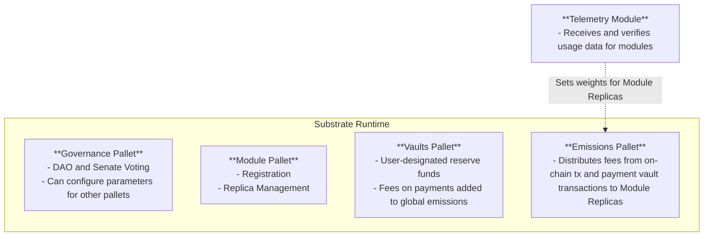

#### AURA (Authority Round) Consensus Mechanism
$MOD Network will utilize Substrate's default AURA consensus for predictable block production with designated authorities rotating block production responsibilities.
#### Substrate Runtime Architecture

$MOD Network will be built on Substrate's modular runtime architecture, establishing custom pallets for the following:
- **Governance**: The governance pallet will be responsible for handling governance actions, via a DAO voting system with an established senate. The Governance system will be capable of configuring the parameters for modules and managing the network.
- **Module**: The module pallet will be responsible for the registration and management of modules and their replicas.
- **Vaults**: The vaults pallet will be responsible for the management of user-designated reservations of funds for module usage.
- **Emissions**: The emissions pallet will be responsible for the distribution of transaction fees as well as payment fees from the payment vaults system to the individual module replicas. The distribution will be determined by the weights set by the Telemetry Module.
