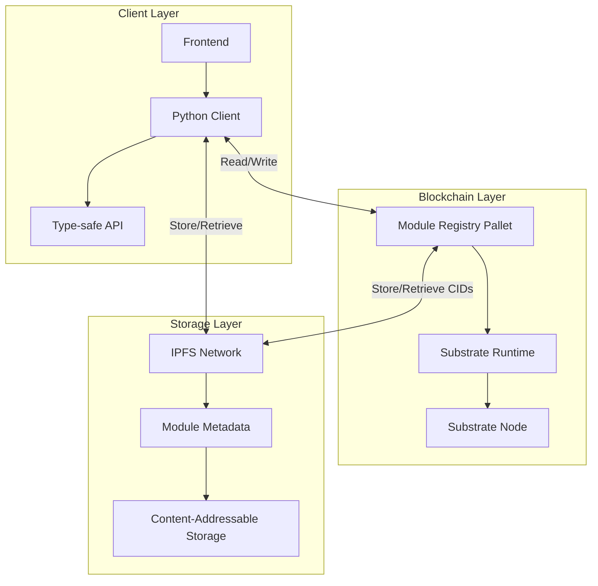
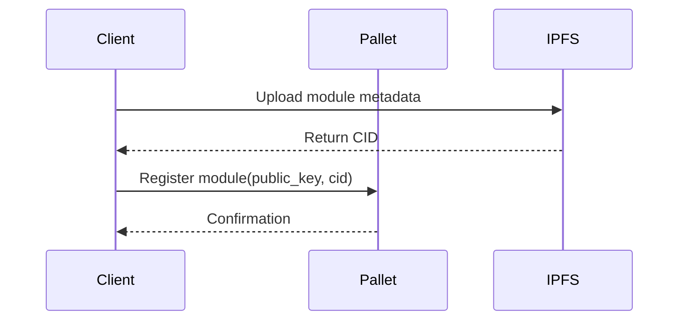
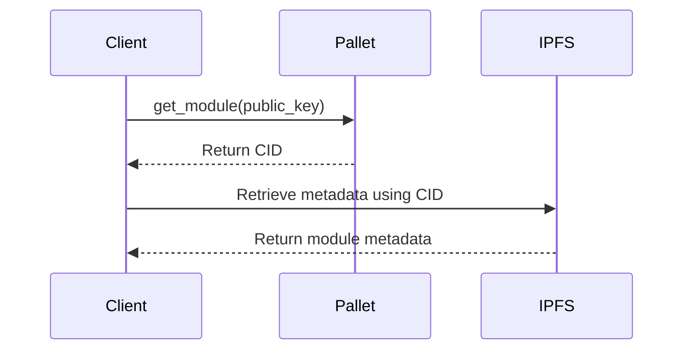
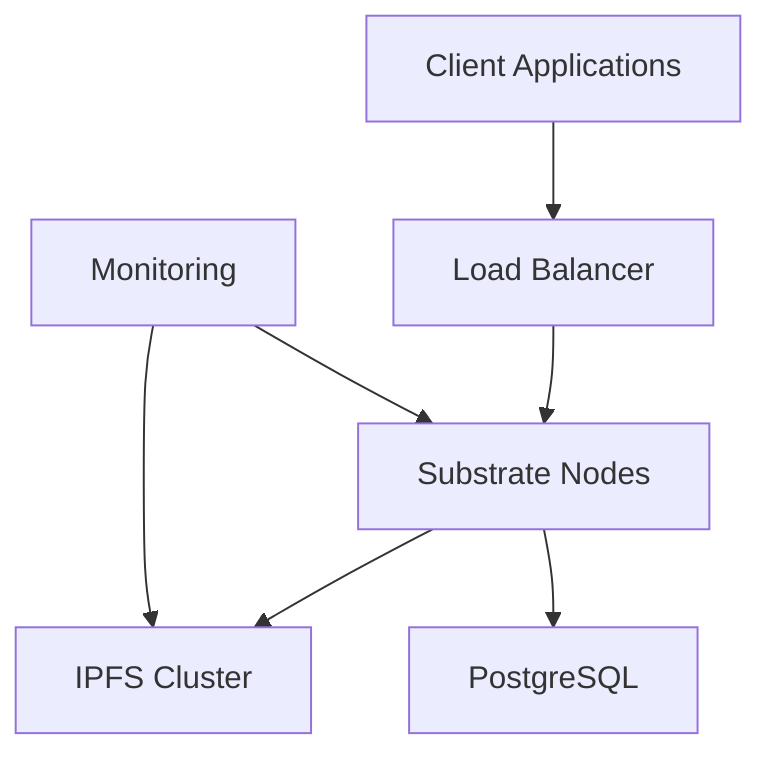

# Mod Pallet Architecture

## Overview

Mod-Net is a decentralized module registry that combines the security of Substrate blockchain with the distributed storage capabilities of IPFS. The system is designed to be modular, extensible, and production-ready, providing a minimal, scalable, and content-addressable module registry with multi-chain compatibility.

**Lead Developer**: Bako  
**Repository**: [Module Pallet](https://github.com/bakobiibizo/mod-net-modules)  
**IPFS Service**: [IPFS Off Chain Service](https://github.com/bakobiibizo/commune-ipfs)

## System Architecture

### High-Level Architecture



### Core Components

#### 1. Module Registry Pallet

**Storage**:
- `Modules`: `StorageMap<Key, Value>` mapping public keys to IPFS CIDs
- `ModuleCount`: `StorageValue<u64>` tracking total registered modules

**Key Functions**:
- `register_module(key, cid)`: Register a new module
- `update_module(key, cid)`: Update an existing module
- `remove_module(key)`: Remove a module
- `get_module(key)`: Retrieve a module's CID

#### 2. IPFS Integration

**Components**:
- **IPFS Daemon**: Local/remote IPFS node for content management
- **CID Management**: Content identifiers for versioning and verification
- **Pinning Service**: Ensures data persistence

**Features**:
- 🚀 FastAPI backend for file management
- 📁 Distributed storage with content addressing
- 🔍 Metadata search and filtering
- 📊 Local SQLite for file indexing
- 🌐 Web interface for file management

#### 3. Python Client

**Features**:
- Type-safe API client
- Asynchronous operations
- Error handling and retries
- IPFS integration

**Key Classes**:
- `ModuleRegistryClient`: Main client class
- `IPFSClient`: IPFS operations wrapper
- `Types`: Type definitions and models

## Data Structures

### Mod Struct
The core of the Modules System is the following struct:
```rust
struct Mod<T: Config> {
	id: u64,
	key: AddressIdOf<T>, // Address of Module's Owner
	url: BoundedVec<u8, T::ModURLMaxSize>,
	data: Option<BoundedVec<u8, T::ModMaxDataSize>>,
	take: u8, // Percentage of revenue given to Module's Owner
	max_replicas: u8, // Min 0, Max 255 (u8::MAX)
	collateral: u64, // Balance reserved for registration
}
```

The Mod struct will be represented in the chain storage as a `StorageMap` with the `id` being the key. A global index of Mods will be implemented, with the maximum being set by the Global Parameters `N` value.

### Replica Struct
```rust
struct Replica<T: Config> {
	id: u64, // Index of replica in ModNet
	key: AddressIdOf<T>, // Key of Replica Owner
	url: Option<BoundedVec<u8, T::ModMaxDataSize>>,
	modId: u64, // ID of the Mod for this Replica
	collateral: u64, // Balance reserved for registration
}
```

### On-Chain Storage Schema

```rust
#[pallet::storage]
#[pallet::getter(fn module_registry)]
pub(super) type ModuleRegistry<T: Config> = StorageMap<
    _,                 // Default: Blake2_128Concat
    Blake2_128Concat,  // Hasher for efficient key lookups
    Vec<u8>,           // Key: Multi-chain public key (Ed25519, Ethereum, Solana)
    Vec<u8>,           // Value: IPFS CID pointing to off-chain metadata
>;
```

### Off-Chain Metadata Schema

The recommended metadata structure stored in IPFS:

```json
{
  "name": "text-gen-v1",
  "version": "1.0.0",
  "author": "Bakobiibizo",
  "cid": "bafybeibwxyzmoduledata",
  "entrypoint": "main.py",
  "args": {
    "max_tokens": 512,
    "temperature": 0.7
  },
  "custom": {
    "gpu": "A6000",
    "runtime": "python3.10"
  }
}
```

### Global Parameters
The following table represents the Global Parameters of the Mod pallet. These Global Parameters will be represented in storage as a single struct called `ModGlobalParams`.

| Global Param | Type | Default           | Description                               |
| ------------ | ---- | ----------------- | ----------------------------------------- |
| N            | u64  | 20,000            | Number of Maximum Mods                    |
| TakeMin      | u8   | 0                 | Minimum percentage of take for a module   |
| TakeMax      | u8   | 77 (~30%)         | Maximum percentage of take for a module   |
| URLMaxSize   | u8   | 255 (u8::MAX)     | Maximum length of a Mod's URL             |
| DataMaxSize  | u8   | 255 (u8::MAX)     | Maximum length of a Mod's Data String     |
| ReplicaMax   | u64  | 65,535 (u16::MAX) | Maximum replicas the Module Owner can set |

## Multi-Chain Key Support

- **Ed25519**: 32-byte public keys (Polkadot/Substrate native)
- **Ethereum**: 20-byte addresses or 64-byte public keys
- **Solana**: 32-byte public keys
- **Flexible**: `Vec<u8>` format supports future key types

## Runtime Calls

### `register_module(key: Vec<u8>, cid: Vec<u8>)`
- Inserts or updates a module entry
- `key`: Multi-chain public key (Ed25519, Ethereum, Solana)
- `cid`: IPFS CID pointing to off-chain metadata
- Validates key format and CID structure

### `get_module(key: Vec<u8>) -> Option<Vec<u8>>`
- Returns the stored IPFS CID for the given public key
- Use CID to fetch metadata from IPFS

### `remove_module(key: Vec<u8>)`
- Deletes a module entry from the registry
- Does not remove metadata from IPFS (content-addressed)

## Data Flow

### Module Registration


### Module Retrieval


## Development Setup

### Prerequisites
- Rust 1.70+ (install via [rustup](https://rustup.rs/))
- Python 3.10+
- IPFS 0.15.0+
- Node.js 18+ (for frontend development)
- Git
- UV package manager (`pip install uv`)

### Environment Setup

#### 1. Clone the Repository
```bash
git clone --recursive https://github.com/Bakobiibizo/mod-net-modules.git
cd mod-net-modules/modules
```

#### 2. Set Up Rust
```bash
# Install Rust toolchain
rustup toolchain install stable
rustup target add wasm32-unknown-unknown --toolchain stable

# Install wasm-opt for optimized builds
cargo install wasm-opt
```

#### 3. Set Up Python Environment
```bash
# Create and activate virtual environment
uv venv
source .venv/bin/activate  # On Windows: .venv\Scripts\activate

# Install development dependencies
uv pip install -r requirements-dev.txt
```

#### 4. Install IPFS
```bash
# Install IPFS
ipfs init
ipfs config --json API.HTTPHeaders.Access-Control-Allow-Origin '["*"]'
ipfs config --json API.HTTPHeaders.Access-Control-Allow-Methods '["PUT", "GET", "POST"]'
```

### Building the Project

#### Build Substrate Node
```bash
# Debug build
cargo build

# Release build (recommended for development)
cargo build --release
```

#### Build Python Package
```bash
# Install in development mode
uv pip install -e .

# Or build a wheel
python -m build
```

### Running Tests

#### Rust Tests
```bash
# Run all tests
cargo test --all

# Run specific test
cargo test -p pallet-module-registry
```

#### Python Tests
```bash
# Run all tests
pytest

# Run specific test file
pytest tests/test_module_registry.py -v
```

## CI/CD Pipeline

Our CI/CD pipeline uses GitHub Actions with three main workflows:

### 1. Rust CI (`rust.yml`)
- **Check**: Runs `cargo check` on all targets
- **Test Suite**: Runs `cargo test --all` with coverage reports
- **Clippy**: Enforces Rust coding standards
- **Format**: Verifies code formatting
- **Documentation**: Builds and validates documentation

### 2. Python CI (`python.yml`)
- **Lint and Type Check**: `black`, `isort`, `ruff`, `mypy`
- **Test**: pytest with coverage reporting
- Uses UV for dependency management

### 3. Integration Tests (`integration.yml`)
- Sets up IPFS service container
- Configures Rust and Python environments
- Runs combined integration tests
- Verifies IPFS integration

## Production Deployment

### Infrastructure Requirements

| Component | CPU | Memory | Storage | Nodes |
|-----------|-----|--------|---------| ------ |
| Validator | 4   | 16GB   | 500GB   | 3      |
| Full Node | 2   | 8GB    | 1TB     | 5+     |
| RPC Node  | 4   | 8GB    | 100GB   | 2      |
| IPFS Node | 4   | 16GB   | 2TB     | 3      |

### Deployment Architecture



### Using Helm

1. Add the Helm repository:
   ```bash
   helm repo add mod-net https://charts.mod-net.io
   helm repo update
   ```

2. Create a values file (`values-prod.yaml`):
   ```yaml
   replicaCount: 3

   node:
     chain: production
     basePath: /data
     nodeKey: "YOUR_NODE_KEY"

     resources:
       limits:
         cpu: 4
         memory: 16Gi
       requests:
         cpu: 2
         memory: 8Gi

   monitoring:
     enabled: true
     prometheus:
       enabled: true

   ipfs:
     cluster:
       enabled: true
       bootstrapPeers:
         - "/ip4/IP_ADDRESS/tcp/9096/ipfs/Qm..."
   ```

3. Install the chart:
   ```bash
   helm install mod-net mod-net/mod-net -f values-prod.yaml
   ```

## Security Considerations

### Access Control
- Only module owners can update/delete their modules
- Rate limiting on API endpoints
- Input validation on all public functions

### Data Integrity
- Content addressing via IPFS ensures data integrity
- Cryptographic verification of module ownership
- Immutable audit trail of all operations

### Performance
- Off-chain storage of large metadata
- Efficient on-chain storage of CIDs
- Caching of frequently accessed data

## Constraints

### Key Constraints
- Ed25519: 32 bytes
- Ethereum addresses: 20 bytes
- Ethereum public keys: 64 bytes
- Solana: 32 bytes
- Max key length: 64 bytes (enforced by runtime)

### Value Constraints
- IPFS CID format validation
- Typical CID length: 34-59 bytes
- Max value length: 128 bytes (CID storage only)
- Uniqueness: Keys must be unique per public key owner
- Validation: Both key format and CID structure validated

## Design Principles

- **Content-addressed**: IPFS ensures immutability of metadata
- **Multi-chain compatibility**: Support for Ed25519, Ethereum, and Solana keys
- **Cost-efficient**: Only CIDs stored on-chain, reducing storage costs
- **Decoupled storage**: Metadata lives off-chain, registry provides addressing
- **Extensible**: Flexible key format supports future blockchain integrations
- **Composable**: Easily layered with future consensus registry or version control
- **Immutable references**: CIDs provide tamper-proof metadata addressing

## Python Client Example

```python
from substrateinterface import SubstrateInterface
import ipfshttpclient
from cryptography.hazmat.primitives import serialization

# Initialize connections
substrate = SubstrateInterface(
    url="ws://127.0.0.1:9944",
    type_registry_preset='substrate-node-template'
)
ipfs = ipfshttpclient.connect('/ip4/127.0.0.1/tcp/5001')

# Prepare metadata
metadata = {
    "name": "text-gen-v1",
    "version": "1.0.0",
    "author": "Bakobiibizo",
    "entrypoint": "main.py",
    "args": {"max_tokens": 512, "temperature": 0.7},
    "custom": {"gpu": "A6000", "runtime": "python3.10"}
}

# Upload metadata to IPFS
result = ipfs.add_json(metadata)
cid = result['Hash'].encode('utf-8')

# Use public key as registry key (example: Ed25519)
public_key = b"\x12\x34..."  # 32-byte Ed25519 public key

# Register module with CID
substrate.compose_call(
    call_module='ModuleRegistry',
    call_function='register_module',
    call_params={'key': public_key, 'cid': cid}
)

# Retrieve and fetch metadata
stored_cid = substrate.query(
    module='ModuleRegistry',
    storage_function='module_registry',
    params=[public_key]
)
if stored_cid:
    metadata = ipfs.get_json(stored_cid.decode('utf-8'))
```

