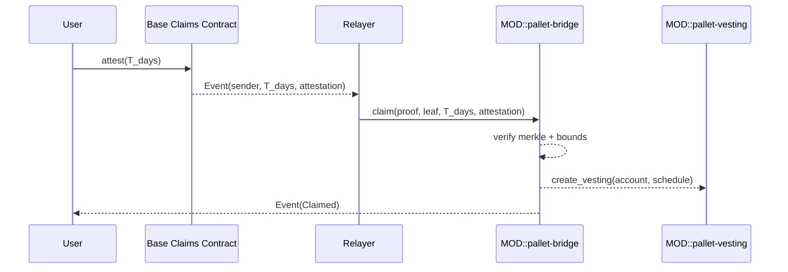
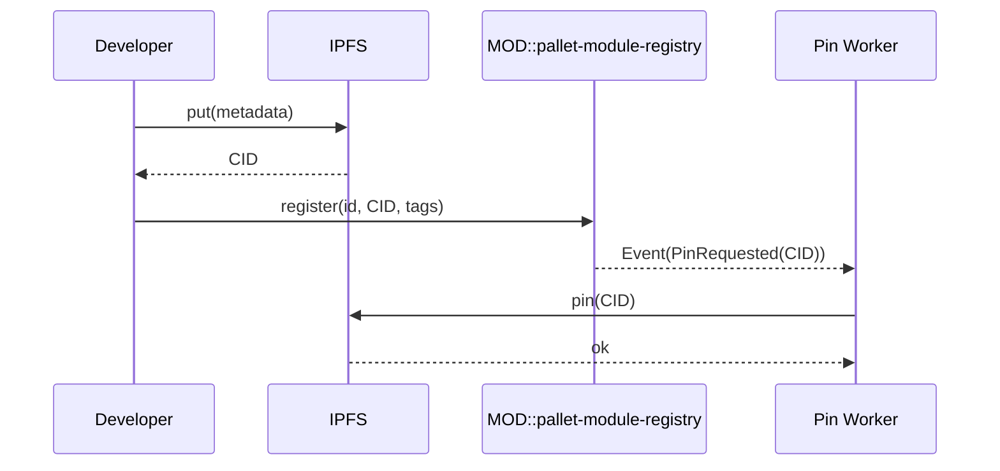

# MOD Chain — Architecture (v0.1)

> Working draft for the solochain architecture that delivers bridge + vesting + module/IPFS registry, starting from a Substrate node template.

---

## 1) Goals & Non‑Goals

### Goals

* Enable one‑time COM → MOD migration with user‑selected vesting (convex multiplier favoring long duration).
* Provide a minimal, production‑grade Substrate solo‑chain with governance, treasury, and observability.
* Ship a module registry pallet backed by IPFS (CID‑based metadata, pinning pipeline) usable by the SDK/UI.
* Keep EVM/Frontier compatibility available for integrations and Base‑chain touchpoints.

### Non‑Goals (v0)

* Generic bi‑directional live bridge.
* ink! contracts runtime.
* Parachain/XCM integration.

---

## 2) System Overview

```mermaid
flowchart LR
  %% Actors
  user[User / Holder]\nWallets (Substrate + EVM)
  dev[Module Developer]
  gov[Governance]

  %% On-chain (MOD)
  subgraph MOD Chain (Substrate Solo)
    runtime[Runtime\nFRAME pallets]
    br[pallet-bridge]
    vest[pallet-vesting]
    reg[pallet-module-registry]
    pin[pallet-ipfs-pin (events)]
    tre[pallet-treasury]
    govp[pallet-referenda/collective]
    evm[Frontier (EVM/Ethereum RPC)]
  end

  %% Off-chain infra
  subgraph Off-chain Services
    relayer[Claims Relayer\n(Base → MOD)]
    ipfsd[IPFS Cluster/Daemons]
    pinning[Pinning Worker]
    indexer[Indexer + Metrics]
  end

  %% External
  subgraph Base L2
    basec[Claims Contract\n(attest T_days)]
  end

  subgraph Clients
    sdk[SDKs (Rust/TS/Python)]
    ui[Bridge + Registry UI]
  end

  user --> ui
  dev --> ui
  ui --> sdk
  sdk --> runtime
  br --- vest
  reg --> pin
  pin -->|emit events| pinning
  pinning <-.-> ipfsd
  reg <-.CID.-> ipfsd

  %% Bridge path
  user --> basec
  relayer --> br
  basec -.events.-> relayer

  %% EVM exposure
  sdk -.eth_* RPC.-> evm
  evm --- runtime
  gov --> govp
```

---

## 3) Core Components

### 3.1 Substrate Runtime (FRAME)

**Mandatory pallets**

* `frame-system`, `pallet-timestamp`, `pallet-balances`, `pallet-utility` (batch/multisig), `pallet-treasury`.
* Governance: `pallet-referenda`/`pallet-collective` (+ temporary `pallet-sudo` during bootstrap only).

**Project pallets**

* **`pallet-bridge`**: stores Merkle root + snapshot metadata; validates claim proofs and mints vesting schedules. Params: `R`, `T_min`, `T_max`, `k`, `unlock_shape`. Pause switch.
* **`pallet-vesting`**: per‑account schedules; linear or back‑loaded unlock curves; prevents transfer of locked funds; emits unlock events.
* **`pallet-module-registry`**: module id → CID mapping, metadata, owner; register/update/retire; enforces CIDv1 + size limits; tags; emits `Registered/Updated/Retired`.
* **`pallet-ipfs-pin`** (thin): queues `Pin/UnpinRequested` events consumed by the pinning worker.

**EVM/Frontier (optional but wired)**

* `pallet-evm`, `pallet-ethereum`, `pallet-base-fee`, `pallet-dynamic-fee`, `pallet-evm-chain-id` + custom precompile set (balance transfer, staking, ed25519 verify). Expose Ethereum‑compatible RPC via node service. Gate behind a cargo feature profile (e.g., `--features evm`).

### 3.2 Off‑chain Services

* **Claims Relayer**: watches `Base` contract events (`address, T_days, signature/attestation`), submits `pallet-bridge::claim(proof, leaf, T_days)` to MOD. Idempotent; rate‑limited; retries; finality aware.
* **Snapshot Builder**: extracts balances at `S_height`, filters dust (< ED), builds canonical JSON + Merkle tree, publishes JSON to IPFS, and sets the root on‑chain via governance.
* **IPFS Pinning Worker**: consumes `pallet-ipfs-pin` events, pins CIDs onto an IPFS cluster; verifies availability; re‑queues on failure.
* **Indexer + Dashboards**: tracks `Claimed` events, T‑distribution, emissions per day, treasury vesting, module registry stats. Publish Prometheus metrics + Grafana dashboards.

### 3.3 Client Layer

* **SDKs**: typed bindings for bridge/vesting/registry; IPFS helpers; EVM RPC helpers if `evm` is enabled.
* **Web UI**: bridge claim flow, vesting calculator, module registry CRUD.

---

## 4) Data & Types

### 4.1 Bridge

* **Storage**

  * `MerkleRoot: H256`
  * `SnapshotBlock: u64`, `SnapshotTime: u64`
  * `BaseRatio: FixedU128`
  * `Params { t_min: Days, t_max: Days, k: u16, unlock_shape: enum }`
  * `Claimed: map<AccountId, bool>`
  * `Paused: bool`
* **Leaf tuple**: `(account: AccountId, balance: u128, snapshot_block: u64, chain_id: u64, salt: H256)`
* **Events**: `Claimed{account, base, t_days, effective}`, `ParamsUpdated`, `Paused/Unpaused`.

### 4.2 Vesting

* `Schedule { start, duration_days, total: Balance, released: Balance, curve: Linear|BackLoaded(q) }`

### 4.3 Module Registry

* `ModuleId = BoundedVec<u8, MaxIdLen>`
* `Cid = Multihash (CIDv1)`
* `Metadata { cid, tags: BoundedVec<Tag, MaxTags>, size: u32, owner: AccountId }`

---

## 5) Key Flows

### 5.1 COM → MOD Migration (via Base)

1. **Snapshot** legacy COM chain at `S_height`; publish JSON + totals to IPFS; propose `MerkleRoot` on MOD via governance.
2. User calls **Base Claims Contract** to pick `T_days` (their vesting duration). Contract emits an event with `(msg.sender, T_days, sig/attestation)`.
3. **Relayer** submits `claim(proof, leaf, T_days)` to MOD with the user’s Merkle proof and Base attestation.
4. `pallet-bridge` verifies proof + bounds, computes effective entitlement:

   * Base entitlement: `E_base = balance * R`.
   * Multiplier: `f(T) = (T/T_max)^k` (k > 1).
   * Effective: `E = E_base * f(T)`.
5. `pallet-vesting` creates the schedule; `Claimed` event is emitted.
6. After a defined window, **Treasury** receives unclaimed allocation vested at `T_max`.

### 5.2 Module Registration

1. Developer uploads module metadata to IPFS; obtains CID.
2. Calls `registry::register(id, cid, tags, size)`.
3. `pallet-ipfs-pin` emits `PinRequested(cid)`; worker pins CID and reports status to logs/metrics.

### 5.3 Observability

* Node exposes Prometheus; pallets emit structured events; indexer computes:

  * Claimed vs. unclaimed totals; weighted average T; daily emissions; module counts.

---

## 6) Security & Safety

* **Replay resistance**: include `chainId` + `snapshot_block` + `salt` in Merkle leaves; relayer is hard‑coded to Base chain id + contract address.
* **Pause toggles**: `bridge.pause()`, `vesting.pause()` guarded by governance.
* **Idempotency**: `Claimed` map prevents double claims; state written before vesting to avoid reentrancy.
* **Dust policy**: balances below ED excluded; rule published with snapshot.
* **Rate limiting**: optional `MaxClaimsPerBlock` to protect RPC when claims open.
* **Key management**: relayer hot wallet with low privileges; governance keys in multisig; remove `sudo` after launch.

---

## 7) Performance Targets

| Path                                       | Target                         |
| ------------------------------------------ | ------------------------------ |
| Claim verification (incl. Merkle)          | < 200ms per extrinsic          |
| Vesting unlock event handling              | < 50ms                         |
| Registry read (CID fetch via IPFS gateway) | p50 < 500ms, p95 < 2s          |
| Concurrent claim throughput                | 50–100 tx/block (configurable) |

---

## 8) Deployment & Environments

* **Local/Devnet**: no EVM, fast‑forward epoching, faucet, open governance.
* **Testnet**: Frontier enabled (feature flag), canary Merkle root, real pinning cluster, dashboards.
* **Mainnet**: governance‑controlled params; EVM optional; snapshot/root finalized; relayer HA.

**Feature flags**

* `evm`: include Frontier pallets & RPC.
* `claims`: enable bridge pallet; off by default for devnet.

---

## 9) Version Matrix & Dependencies

* Rust ≥ 1.70; Substrate FRAME ≥ 4.x; IPFS ≥ 0.15; Frontier stack aligned with runtime.
* Node releases are tagged; runtime spec version bumps follow semantic rules (storage migrations tested).

---

## 10) Interfaces (extrinsics)

* `bridge::set_params(R, T_min, T_max, k, unlock_shape)` (gov)
* `bridge::claim(proof, leaf, T_days)`
* `vesting::force_vest(account, schedule)` (gov/tech committee)
* `registry::{register, update, retire, transfer_ownership}`
* `ipfs_pin::{request_pin, request_unpin}` (optional)

---

## 11) Risks & Mitigations

* **Bad snapshot/root** → gated by governance vote + public dispute window before enabling claims.
* **Relayer failure** → UI supports manual submission; run 2+ relayers; on‑chain path is the source of truth.
* **IPFS availability** → multi‑provider pinning; periodic re‑validation; CID pin queues with backoff.
* **Parameter mis‑set** → time‑locked governance changes; dry‑run on testnet.

---

## 12) Open Questions

* Do we require the Base attestation signature, or is event‑only sufficient? (Recommendation: signature to bind `T_days` to the caller.)
* Frontier feature default: on testnet only, or always available under a flag on mainnet?
* Include `pallet-assets` in v0 if multi‑asset modules are anticipated?

---

## 13) Appendix – Sequence Diagrams

### 13.1 Claim Flow



### 13.2 Module Registration



---

## 14) Next Steps (build order)

1. Fork Substrate node template; update toolchain/libraries; add core FRAME pallets.
2. Implement `pallet-bridge` (Merkle proof, params, pause) + unit tests.
3. Integrate `pallet-vesting` (linear first; add back‑loaded curve); wire to bridge.
4. Port `pallet-module-registry` + minimal `pallet-ipfs-pin`; provision IPFS cluster.
5. Wire Frontier under `evm` feature; expose RPC; confirm precompile set.
6. Observability: Prometheus, logs, and indexer; basic dashboards.
7. Testnet: publish canary Merkle root; dry‑run governance; faucet + explorer.
